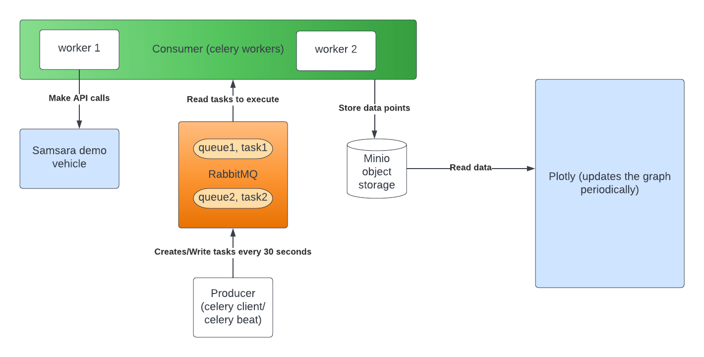
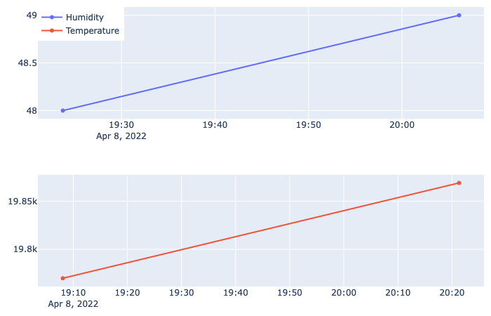

# Plot sensor data (Demo vehicle)
Version: 0.0.1

This project fetches Samsara sensor data using its API and plots it on a plotly dash Graph. There are multiple services that are orchestrated using docker compose, as shown in the diagram below.



API ENDPOINTS considered for this project are:
- https://api.samsara.com/v1/sensors/temperature
- https://api.samsara.com/v1/sensors/humidity

Every task created by celery beat every 30 seconds does two things
- Makes API calls (Sensor data)
- Stores sensor data (temperature and humidity) in an object storage

One can see the object storage UI here:
- http://localhost:90 (the credentials are set in docker-compose.yml - MINIO_ACCESS_KEY, MINIO_SECRET_KEY)

The Plotly service reads from this object storage every 2 seconds
- It runs on http://localhost:80

## Structure
```
├── docker-compose
├── Dockerfile
├── .dockerignore
├── requirements.txt
├── samsara.png
├── samsaraplot.png
├── README
└── app/
       ├── worker.py
       └── tasks.py
       └── app.py
```

### Usage
Environment variables (set in docker-compose)
- SAMSARA_API_KEY  
- SENSOR_ID

The rest of the env variables can be left as default, or changed as needed

- To make a build and install all dependencies (takes ~2mins)
```
docker-compose build
```
- To run the services
```
docker-compose up
```

To access the plotly UI (refreshes every 2 seconds)
- https://localhost:80

Example plot Below


To access the object storage UI
- http://localhost:90
